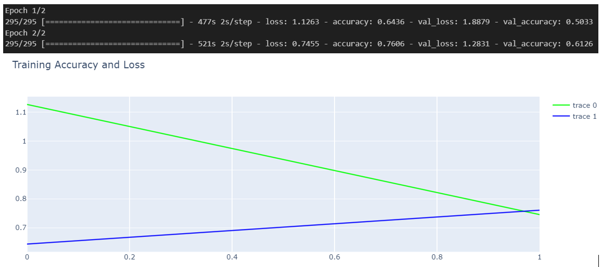

# ChangeLog

## Changes
### Notebook
If you wish to experiment with the code, you can find the notebook in the reposititory at the link below. There is no collab notebook due to the size of the dataset exceeding GitHub's size limit.<br> 
[Notebook - Animal Classification](https://colab.research.google.com/drive/1TCBJv__WFIy80_jBQQWCfklHgFmN3LZ2?usp=drive_link)
<br>
### Project Goals
 This project was inspired and guided by a Jupyter notebook that creates a custome Convolutional Neural Network to complete an Image Classfication task. This notebooks can be found [here](https://www.kaggle.com/code/epiktroll/flowers-recognition-with-custom-cnn) for credit to the author and reference for those interested.
  The notebook referenced creates a Convolutional Neural Network and trains its to identify 5 classes of flowers using a dataset of Flower images. This goal of this project adapts that code and attempts to identify instead 10 classes of animal using a seperate dataset of animal images.

### Data Source
<p> The source notebook utilises a different dataset as per its project requirements. This project instead uses the dataset explained below:

1. **Animals-10**
    - **Description**: This dataset contains a number of animal images seperated in 10 folders. These folders seperate the images into their classes with those classes being dog, cat, horse, spider, butterfly, cow, sheep, squirrel, chicken and elephant. The dataset was compiled for machine learning tasks and contains 26179 images in total.
    - **Usage**: This dataset will be used to develop a Convolutional Neural Network to classify the images.
    - **Source Quality**: This dataset was sourced from Kaggle and has a high usability score from Kaggle users.
    - **Link**: [here](https://www.kaggle.com/datasets/alessiocorrado99/animals10/download?datasetVersionNumber=2)</p>

### Data Exploration
<p> As this project is using a different dataset, some data exploration and preprocessing is required to make sure the data is clean and ready for modelling. The first steps in data exploration was to perform preliminary data exploration and then use a visualsation to analysis the image distribution. There are 26179 images in total in this dataset split amongst the 10 seperate classes as follows:

- Bufferfly: 2112
- Cat:  1668
- Chicken:  3098
- Cow:  1866
- Dog:  4863
- Elephant:  1446
- Horse:  2623
- Sheep:  1820
- Spider:  4821
- Squirrel:  1862
Total number of images:  26179.
Visualising these totals on a graph, we can see that the distribution of images amongst the classes in highly uneven. This may mean our model may be skewed towards predicting the high outlier classes such as Dog and Spider</p>


The next change in data exploration was to check if the dataset needs any cleaning. To do this all folders were checked to confirm that they contain only image files before processing. The results of this can be visualised on the graph below and shows all files were of either jpg, png or jpeg type.


### Data Processing

#### Reading Images to Numpy array
The data processing step involved converting the image files into a numpy array ready to be split into our training, test and validation sets. This step had to be adapted from the reference notebook due to the differences in the file structure of the animal-10 dataset being used for this project. Two main differences had to be accounted for:
1. **File Structure**: As mentioned above, the reference notebook used code that explicitly referenced the folder names of the flower dataset being used. To account for this difference the code was adapted to read the folder names using os.listdir.
2. **Image Shapes**: In the animal-10 dataset, some images were found to contain 3 color channels RGB but others also had a fourth alpha channel. To account for this cv2 was used to read the images to BGR and convert to RBG to ensure all images had the same number of color channels before being input to model.

```
x_ = list()
y = list()
IMG_SIZE = 128
sub_folders = os.listdir(FOLDER)
for folder in sub_folders:
    files = os.listdir(os.path.join(FOLDER, folder))
    path = os.path.join(FOLDER, folder)
    for img in os.listdir(path):
        try:
            file_path = os.path.join(path, img)
            # Read to array
            img_arr = cv2.imread(file_path)
            # BGR to RGB
            torgb = cv2.cvtColor(img_arr,cv2.COLOR_BGR2RGB)
            img_resize = cv2.resize(torgb,(IMG_SIZE,IMG_SIZE))
            x_.append(img_resize)
            y.append(sub_folders.index(folder)) # Labels generated from index of folder
        except:
            None
x = np.array(x_)

```
#### Analysing resultant image array
As the dataset has a different number of images and unbalanced class categories, the code to output a single image from each class also had to be adapted to the following:

```
first_images = {}

# Loop through the images in X
for img, label in zip(x, y):
    # Check if the label already exists in the dictionary
    if label not in first_images:
        # If not, add the image to the dictionary
        first_images[label] = img

plt.figure(figsize=(20, 20))
for label in range(len(first_images)):
    img = first_images[label]
    plt.subplot(4, 3, label + 1)
    plt.imshow(img)
    plt.axis("off")
    plt.title(f'Class {label}')
```
This code output the first image found from each class to show how the class labels were assigned to each folder.


These images were then split into training, test and validation sets at the same ratio as the source notebook. 85% training, 12.75% training data and 2.25 validation data.

### Model Creation

#### Model 1
For the creation model one, the same model as the source notebook was used to get a reference accuracy on this classification task. Due to the increased size of the dataset, the epoch value was changed from 50 to 2. This change will greatly reduce performace of the model but was needed to the the excessive time 50 epochs would take on the larger dataset. As such, the goal of further finetuning will be to get to the highest accuracy in 2 epochs.


#### Model 1 Details
Assessing this model we can see it features:

1. **5 Convolutional Layers with the following features:**:
    - Conv2d : A 2d convolutional layer.
        - Using 64 filters: These are the filters that are passed across the features to identify features.
        - 3 x 3 Kernel: The size of the kernel is defined to be 3 X 3 so each filter will analyse 9 pixels.
        - Padding=same: This setting specifies that the input be padded to match output feature map.
        - Relu: Sets relu as the activation function. 
    - MaxPool2d: A max pooling layer set at 2 x 2 which will only keep the max values in each region as it slides across the image. This is used to extract the most important features. 
    - BatchNormalisation: A normalising layer.
    - Dropout Layer: This layer randomly assign 30% of the input units to 0 to attempt to prevent overfitting.

2. **1 Fully Connected Layer**:
    - This is the layer used to learn from the features extracted by the convolutional layers.
3. **Output Layer**:
    - Finally we have an output layer set to 10 classes to output the final class predictions.

Finally the model uses:
- Categorical Crossentropy as its loss function which measures the difference between predicted probability vs the true labels
- Adam as the optimizer to minimise the loss function.
- Accuracy as the metric to be evaluate performance through epochs.

#### Model 1 Evaluation

1. Epoch 1:
    - Training Loss: 1.6363
    - Training Accuracy: 46.39%
    - Validation Loss: 1.4392
    - Validation Accuracy: 52.88%
2. Epoch 2:
    - Training Loss: 1.3860
    - Training Accuracy: 53.71%
    - Validation Loss: 2.3409
    - Validation Accuracy: 35.17%
Looking at these results we see the training loss decrease in the second epoch indicating the model is learning. The training accuracy also increased over epochs to over 50% indicating learning however many more epochs would be required to really tune model performance. However, validation accuracy decreases indicating that overfitting may be occuring with the model not generalsing to new data. Higher dropout rate may be used to try to prevent this but further epochs may also decrease this problem. 


#### Model 2
For the creation model two , the dropout rates for the convolutional layers were increase from .3 and .2 to .4 and .3. This was done to try to prevent overfitting and analyse if it can decrease the decrease in performance on the validation set between Epoch 1 and Epoch 2. The second change was to decrease learning rate from .001 to .00075 to try increase model stability.

#### Model 2 Evaluation

1. Epoch 1:
    - Training Loss: 2.0248
    - Training Accuracy: 34.97%
    - Validation Loss: 1.8920
    - Validation Accuracy: 42.54%
2. Epoch 2:
    - Training Loss: 1.5530
    - Training Accuracy: 48.26%
    - Validation Loss: 1.3872
    - Validation Accuracy: 54.31%

Evaluating these results:
- Overall learning rate is slower which is to be expected since lr was decreased to .00075
- Overall accuracy was decreased for the second epoch, once again, expected with slower learning rate
- However, increased dropout rate seems to have worked with less overfitting occuring and validation set accuracy increasing from first to second epoch.

#### Model 3
For Model 3, instead of creating a custom Convolutional Network, this model will use the pretrained Inception Neural Net created by Google and use transfer learning to try and increase performance over 2 Epochs. To implement this the model and weights are imported from the keras library and then the output layer is changed to match this projects requirements with the following code, credit to https://github.com/keras-team/keras/issues/10554:

```
output_layer = model2.output
output_layer = GlobalAveragePooling2D()(output_layer)
output_layer = Dense(1024, activation='relu')(output_layer)
predictions = Dense(10, activation='softmax')(output_layer) 
```

#### Model 3 Evaluation

1. Epoch 1:
    - Training Loss: 1.1263
    - Training Accuracy: 64.36%
    - Validation Loss: 1.8879
    - Validation Accuracy: 50.33%
2. Epoch 2:
    - Training Loss: 0.7430
    - Training Accuracy: 76.06%
    - Validation Loss: 1.2831
    - Validation Accuracy: 61.26%
Evaluating these results we see that using a pretrained model in this case leads to significantly increased performance from the first Epoch as its parameters are already trained for Image classification. The model learns at a faster rate than our custom models with training loss down to .76 by only the second Epoch.
The overfitting issue does not seem to be present with validation accuracy increasing from Epoch 1 to Epoch 2.
These results show how transfer learning can be a helpful technique in speeding up the training process for CNNS.
The next steps I would take would be to balance the training data and introduce more training epochs to observe how results change, however this would require long training times beyond the scope of this miniture project.

## Learning Outcomes

1. **Hardware Challenges in Neural Networks**
 I learned that training neural networks can be challenging in terms of time and computational resources. Even training this relatively small neural network over only two Epochs took over twenty minutes. This slows down your ability to quickly change input parameters and tune the network. Multiple times in this project I ran into roadblocks with models running out of RAM and not starting. Training large neural networks probably need to be done on Cloud platforms rather than local hardware.

2. **Learning about Convolutional Layers**
 I learning a lot about the format of Convolutional Neurall Networks and how you build them in terms of setting filter numbers and sizes. I also learning what Pooling layers are and their role in feature extraction.

3. **Importance of Having a Validation Set to Monitor Overfitting**
 This project highlighted the utility and importance of separate validation set as in this project we saw how just observing increased accuracy on the training and test set may miss overfitting with decreasing validation set results. I also learning how techniques like dropout layers can help to reduce overfitting.

4. **Importance of Having a Balanced Training Set**
 This project once again showed how imbalanced in distribution of classes in the training set significantly affects model performance.

5. **Adapting pre-trained models for transfer learning**
This project also showed me the process of adapting pretrained models to a particular task requirements and how using transfer learning can significantly cut down training times for neural networks.
